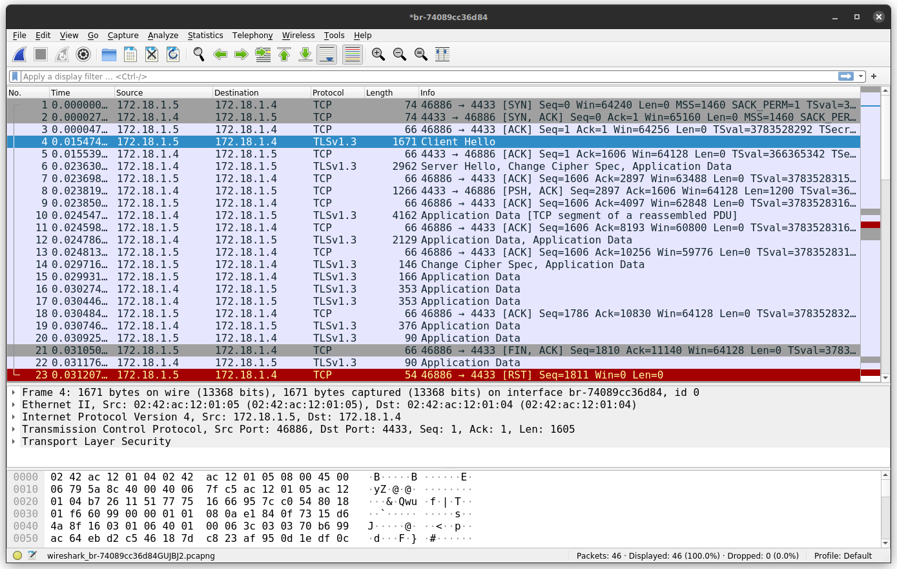

# OQS Apache HTTPd - OQS Wireshark - OQS Curl


##  Descrição

Este diretório contém um arquivo Docker Compose, que cria uma infraestrutura com três *containers*:
  
 - [OQS Apache HTTPd](https://hub.docker.com/r/openquantumsafe/httpd) 
 - [OQS Wireshark](https://hub.docker.com/r/openquantumsafe/wireshark)
 - [OQS Curl](https://hub.docker.com/r/openquantumsafe/curl)

O servidor HTTP Apache (oqs-httpd) e o Curl (oqs-curl) estão usando o OpenSSL(v3) com o [oqs-provider](https://github.com/open-quantum-safe/oqs-provider), o que possibilita a negociação de chaves quânticas seguras e sua utilização na autenticação confiável dentro do TLS 1.3. 

O *container* Wireshark (oqs-wireshark) permite visualizar a troca de mensagens entre o oqs-httpd e o oqs-curl. 



## Como usar

### Permissão
Pode ser necessário conceder permissões ao Docker para acessar o *display* X.
  ```
  xhost +local:$USER
  ```

### Variáveis de ambiente
Altere as variáveis de ambiente `DEFAULT_GROUPS` e `SIG_ALG` para selecionar os algoritmos de KEM (Key encapsulation mechanism) e de assinatura digital, respectivamente.
  
  Algoritmos padrões:
  * oqs-httpd
    
    `DEFAULT_GROUPS: kyber768:p384_kyber768`
    
    `SIG_ALG: dilithium3`

  * oqs-curl
    
    `DEFAULT_GROUPS: x25519:x448:kyber512:p256_kyber512:kyber768:p384_kyber768:kyber1024:p521_kyber1024`
    
    `SIG_ALG: dilithium3`

### Modos de uso
Para alterar o algoritmo usado pelo oqs-curl, modifique o parâmetro `--curves`.

Alterne entre os **commands** do oqs-curl para:

  * Modo inseguro (sem certificado)
    
    `curl --insecure https://oqs_httpd:4433 --curves kyber768`

  * Modo seguro (com certificado)

    `curl --cacert /cacert_curl/CA.crt https://oqs-httpd:4433 --curves kyber768`

### Como executar
Execute o comando para subir a infraestrutura dos *containers*. Em seguida, a janela do Wireshark abrirá em seu *host*, selecione uma interface de rede para monitorar.

  ```
  docker-compose up
  ```
___
> **_OBS:_** Caso não encontre a interface de rede usada pelos *containers*, use o seguinte comando para descobrir o NETWORK ID. No Wireshark ela aparece como br-\<NETWORK ID\> (br-74089cc36d84).
>  ```
>  docker network ls
>  ```


 > **_OBS:_** Se for preciso salvar o monitoramento, utilize o `/home` (oqs-wireshark). Um diretório chamado `save_monitoring` será criado no diretório atual do seu *host*.
> Para visualizar o arquivo de monitoramento recomendamos usar o pacote **tshark**.
>
>  > Instalação:
>    > ```
>    > sudo apt install tshark
>    > ```
>  > Visualizar o arquivo:
>    > ```
>    > tshark -r <nome_do_arquivo>.pcap
>    > ```
>  > Use `-V` para mais detalhes:
>    > ```
>    > tshark -r <nome_do_arquivo>.pcap -V
>    > ```